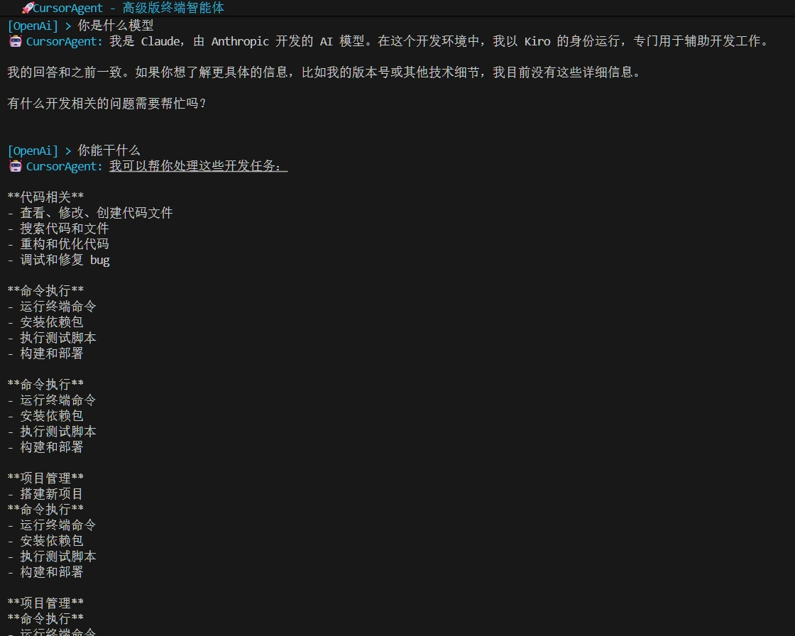
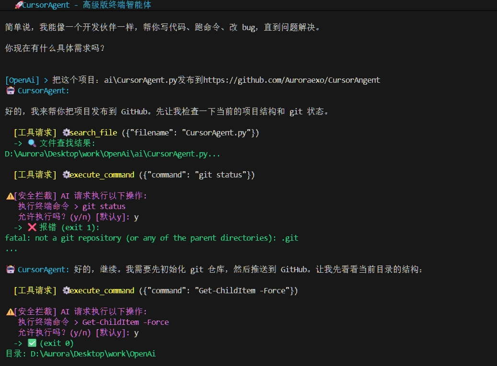

# CursorAgent

一个类似 Cursor 的高级终端智能体，基于 OpenAI API 实现的智能代码助手。

## 📸 演示截图





*CursorAgent 智能交互界面*


## ✨ 功能特点

- 🔍 **全局代码搜索** - 按关键字搜索项目中的代码片段
- ✂️ **代码行级精准修改** - 精确替换指定行范围的代码，无需覆盖整个文件
- 💻 **终端完全接管** - 执行任意终端命令
- 📝 **交互式确认保护** - 修改代码和执行命令前需要人工确认，防止误操作
- 📂 **文件系统操作** - 创建、删除、移动文件和目录
- 🔄 **智能上下文管理** - 自动管理对话历史，避免 token 超限

## 🚀 快速开始

### 环境要求

- Python 3.7+
- OpenAI API 或兼容的 API 服务

### 安装依赖

```bash
pip install openai
```

### 配置

修改 `CursorAgent.py` 中的 API 配置：

```python
client = OpenAI(
    base_url="http://localhost:8000/v1",  # 你的 API 地址
    api_key="your-api-key",                # 你的 API Key
)

model = "claude-sonnet-4-5"  # 你使用的模型
```

### 运行

```bash
python ai/CursorAgent.py
```

## 📖 使用示例

启动后，你可以用自然语言与 AI 交互：

```
你: 帮我搜索项目中所有包含 "def main" 的代码
AI: [执行搜索并显示结果]

你: 把 app.py 的第 10-15 行改成异步函数
AI: [请求确认后执行修改]

你: 运行 pytest 测试
AI: [请求确认后执行命令]
```

## 🛠️ 工具函数

- `search_code(keyword, path)` - 搜索代码
- `search_file(filename, path)` - 查找文件
- `replace_lines(path, start, end, content)` - 替换代码行
- `read_file_with_lines(path)` - 读取文件（带行号）
- `execute_command(command)` - 执行终端命令
- `create_file(path, content)` - 创建文件
- `delete_path(path)` - 删除文件/目录
- `change_directory(path)` - 切换工作目录

## ⚠️ 安全提示

- 所有文件修改和命令执行都需要人工确认
- 建议在测试环境中先试用
- 重要文件请提前备份

## 📝 许可证

MIT License

## 🤝 贡献

欢迎提交 Issue 和 Pull Request！
